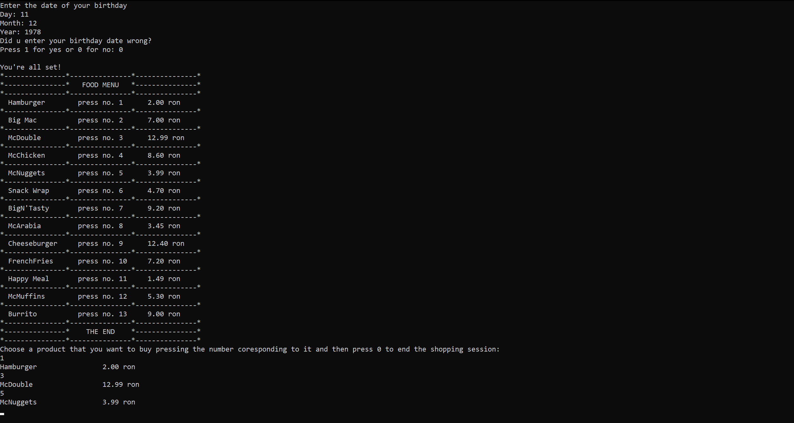
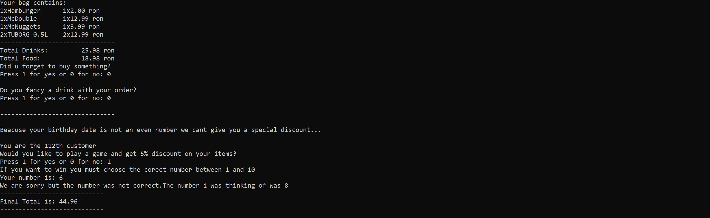

# SelfCheckout Project

## Description

This C language self-checkout machine program replicates the functionality of a typical checkout machine found in retail stores, offering users a streamlined experience for their purchases. It is designed to be user-friendly and efficient, allowing customers to scan items, view their total and also apply discounts obtaind by participating in guessing games

## Application
#### Shop Menu

#### Final Bag

